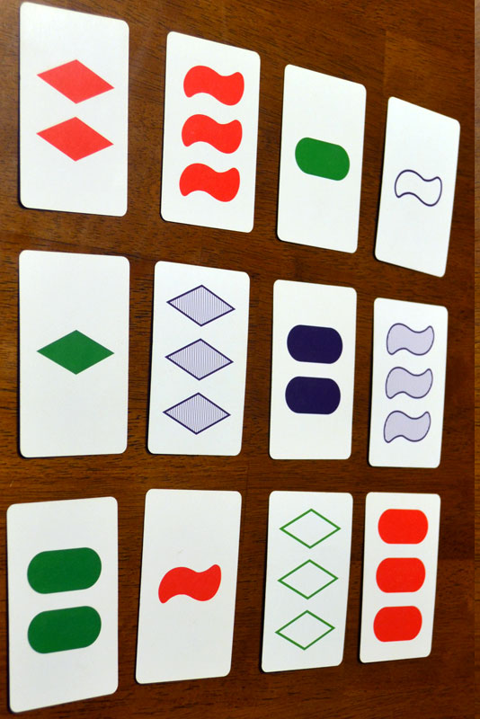
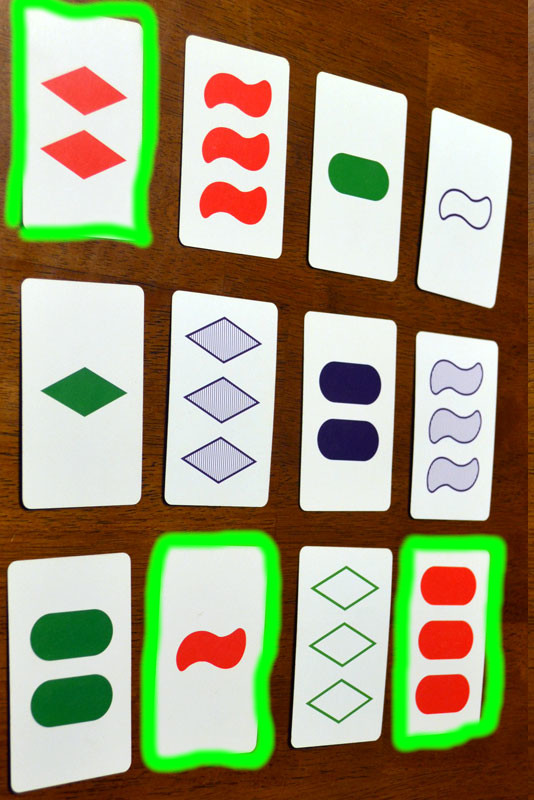
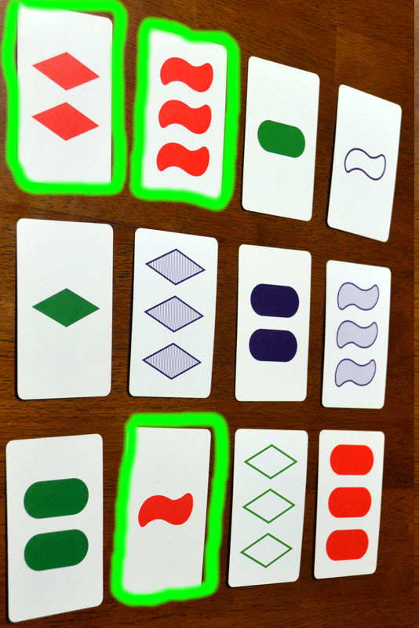
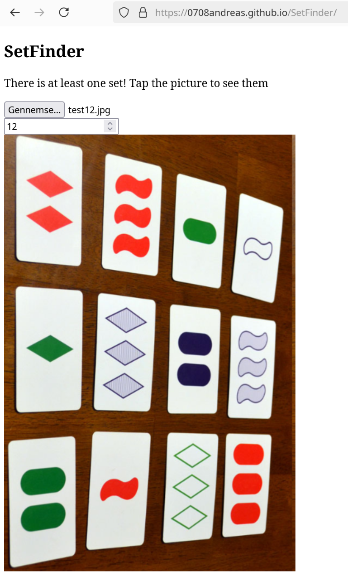
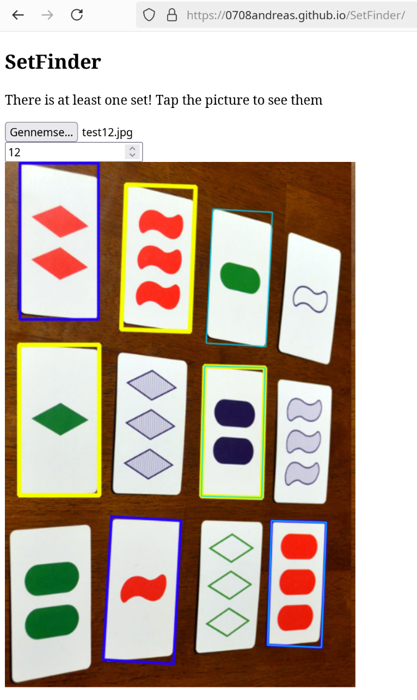

# SetFinder

Demo: [https://0708andreas.github.io/SetFinder/]

Dette er en web-app, der kan detektere, om der er et set i spillet [Set](https://www.setgame.com/sites/default/files/instructions/SET%20INSTRUCTIONS%20-%20DANISH.pdf).

Appen er baseret på [OpenCV.js](https://docs.opencv.org/4.x/d5/d10/tutorial_js_root.html)
og kan køre i alle moderne browsere.

# A hva' for en fisk?
Set er et kort-spil, der handler om at finde stik. På et bord lægger man 12 kort som her: .

Hvert kort har fire egenskaber: antal, form, farve og udfyldning. Et stik består af tre kort, hvor hver egenskab enten er ens på alle tre kort, eller forskellig på alle tre kort. Et eksempel på et stik er her:

Alle tre kort er røde og helt udfyldt, og de tre kort har forskellige antal og forskellige former.

Dette her er ikke et stik:

Det hænder, at der ikke findes et stik iblandt de 12 kort på bordet. I det tilfælde lægger man tre nye kort. Men det kan være svært at afgøre, om der faktisk ikke er nogle stik, eller om man bare har stirret sig blind på bordet. Det er her SetFinder kommer ind i billedet! Man tager bare et billede af bordet, og appen fortæller dig om der er et stik eller ej:

Hvis man har lyst til at snyde, kan appen også fremhæve de kort, der danner stik:

Bemærk, at hvert kort kan indgå i flere forskellige stik. I dette tilfælde er der tre stik: et lyseblåt, et mørkeblåt og et gult. Kortet med to lilla ovaler indgår i både det lyseblå og det gule stik, og kortet med tre røde ovaler indgår i begge blå stik. Jeg prøver stadg at finde en bedre måde at indikere hvilke kort, der hører sammen. Hvis du har nogle ideer, så åbn et issue :D
